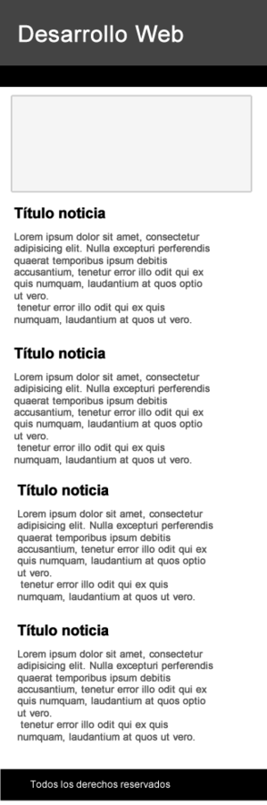

# Ejercicios bootstrap

## Ejericio 1
Utilizando el sistema de grillas, construya el siguiente layout

 

* [1] [Guía de instalación de bootstrap3] (https://github.com/mcantillana/guias-bootstrap3)
* [2] [Guía de sistema de grillas] (https://openwebinars.net/tutorial-bootstrap-3-sistema-grid/)

## Ejercicio 2
Se pide construir el siguiente layout con bootstrap

 

* [1] [Guía de instalación de bootstrap3] (https://github.com/mcantillana/guias-bootstrap3)

## Ejercicio 3

* Construya el layout propuesto en la figura que se presentará a continuación, utilizando bootstrap3
* Utilice todas las clases que bootstrap provee para resolver problemas de layout
* Desarrolle el layout mobile first como se muestran las figuras

### XS
 

### SM
 

### MD y LG
 

## Ejercicio 4 
Utilizando el sistema de grillas de bootstrap3 se pide construir el siguiente layout

 

En el esquema de la figura se pueden ver tres disposiciones de la misma web, la de la izquierda se refiere a los tamaños grandes (lg) y medianos (md), la disposición central al tamaño pequeño o de tablets (sm) y la de la derecha la correspondiente a móviles (xs).
Tienes que aplicar las clases de bootstrap necesarias para que al cambiar el tamaño de la pantalla se cambie la disposición de los bloques como se muestra en el esquema. Tener en cuenta que la columna roja tendrá que desaparecer cuando el tamaño sea extra pequeño (xs).

## Ejericio 5
debes crear una nueva página web usando  Bootstrap3. El contenido aparecerá centrado en la pantalla y constará de tres filas con el siguiente contenido y disposición cuando la pantalla sea de tamaño medio (md) y grande (lg):
* Una fila en la parte superior con una única columna con fondo verde que ocupará todo el ancho, en dicha columna aparecerá el texto "Header" alineado a la izquierda y en grande.
* Una segunda fila con tres columnas en color rojo con el mismo ancho y con los números 1, 2 y 3 (respectivamente) centrados y en letras grandes.
* La tercera y última fila contendrá dos columnas de igual ancho y en color amarillo, la primera columna tendrá el texto "footer 1" alineado a la derecha y la segunda el texto "footer 2" alineado a la izquierda (ambos usando un tamaño de fuente grande).

En la siguiente imagen se puede ver un esquema de la web a realizar:

 

Como se puede ver en el esquema de la imagen la disposición de las columnas y la alineación de los textos variará dependiendo del tamaño de la pantalla. 

Tienes que reproducir este comportamiento para que la apariencia de la web sea similar al esquema (número de columnas, alineaciones de los textos y colores) cuando el tamaño de la pantalla sea la de un tablet (sm) o la de un teléfono (xs). 

Tener en cuenta lo siguiente: 
* Siempre que sea posible se utilizarán las clases que provee Bootstrap.
* Cuando no sea posible (por ejemplo para controlar la alineación de los textos y el cambio de color de fondo) debes definir una media query que lo haga.
