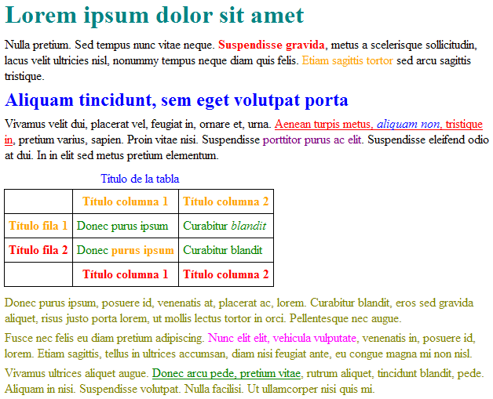

# CSS Básico

## Ejercicio 1
Descargar el archivo HTML desde el siguiente [enlace](https://raw.githubusercontent.com/mcantillana/curso_frontend_html_css/gh-pages/ejercicio_noticia.html) y realice los siguientes pasos:
* Guardar el contenido en un archivo con el nombre noticias.html en alguna carpeta del computador
* Crear un archivo con el nombre style.css y guardarlo en la misma carpeta donde se guardó el archivo noticias.html
* Vincular la hoja de estilo llamada style.css con el archivo noticias. Utilice: 

~~~
<link rel="stylesheet" href="style.css">
~~~

dentro de la etiqueta <head>

* Aplicar los siguientes estilos CSS en style.css
    * Dejar los párrafos con 18px
    * Configurar la clase .titulo_principal  con borde inferior de 5px, solido y de color gris (Utilice: border-bottom: 5px solid #CCC;)
    * Dejar la primera letra de los párrafos con tamaño 42px (Utilice: p:first-letter {font-size:42px})
    * Dejar el fondo de la página de color gris (#EEE) (Utilice: background-color en la etiqueta body)
    * Dejar los títulos de primer nivel (h1) con mayuscula (Utilice: text-transform: uppercase)
    * Agregar borde a todo el contorno de la imágen de color gris (#CCCCCC) y de borde sólido. (Utilice: border:1px solid #FF0000)
    * Agregar margen del 20% a la izquierda y derecha de la etiqueta body (Utilice: margin-left:20% y margen-right:20%)
    * Agregar interlineado a todos los párrafos del sitio de 22px
    * Agregar border-top:1px dashed #CCC a los títulos de segundo nivel  (h2)
    * Agregar al final del documento un video desde youtube y un mapa con la ubicación de la universidad

## Ejercicio 2

Al ejercicio anterior (ejercicio 1) incorpore los siguientes cambios:
* Cambie la tipografía de los títulos por Lato (utilice google fonts)
* Cambie la tipografia de los parrafos por Slabo 27px (utilice google fonts)
* Al pasar el mouse por los enlaces leer más, estos deben tener un color de fondo negro y color de letras blanco

## Ejercicio 3
A partir del código HTML y CSS que se muestra, añadir los selectores CSS que faltan para aplicar los estilos deseados. Cada regla CSS incluye un comentario en el que se explica los elementos a los que debe aplicarse:

~~~
<!DOCTYPE html>
<html lang="es-cl">
<head>
    <meta charset="UTF-8">
    <title>Ejercicio de selectores</title>
    
</head>
 
<body>
 

Lorem ipsum dolor sit amet, <a href="#">consectetuer adipiscing elit</a>. Praesent blandit nibh at felis. Sed nec diam in dolor vestibulum aliquet. Duis ullamcorper, nisi non facilisis molestie, <em>lorem sem aliquam nulla</em>, id lacinia velit mi vestibulum enim.

 

 

Phasellus eu velit sed lorem sodales egestas. Ut feugiat. <a href="#">Donec porttitor</a>, magna eu varius luctus, metus massa tristique massa, in imperdiet est velit vel magna. Phasellus erat. Duis risus. <a href="#">Maecenas dictum</a>, nibh vitae pellentesque auctor, tellus velit consectetuer tellus, tempor pretium felis tellus at metus.

 

Cum sociis natoque <em class="especial">penatibus et magnis</em> dis parturient montes, nascetur ridiculus mus. Proin aliquam convallis ante. Pellentesque habitant morbi tristique senectus et netus et malesuada fames ac turpis egestas. Nunc aliquet. Sed eu metus. Duis justo.

 

Donec facilisis blandit velit. Vestibulum nisi. Proin volutpat, <em class="especial">enim id iaculis congue</em>, orci justo ultrices tortor, <a href="#">quis lacinia eros libero in eros</a>. Sed malesuada dui vel quam. Integer at eros.

 
</body>
</html>
~~~

## Ejercicio 4
A partir del código HTML proporcionado, añadir las reglas CSS necesarias para que la página resultante tenga el mismo aspecto que el de la siguiente imagen:

*Aspecto final de la página*

A continuación se muestra el código HTML de la página sin estilos:

~~~
<!DOCTYPE html>
<html lang="es-cl">
<head>
    <meta charset="UTF-8">
    <title>Ejercicio de selectores</title>
</head>
 
<body>
<h1 id="titulo">Lorem ipsum dolor sit amet</h1>
 

Nulla pretium. Sed tempus nunc vitae neque. <strong>Suspendisse gravida</strong>, metus a scelerisque sollicitudin, lacus velit 
ultricies nisl, nonummy tempus neque diam quis felis. Etiam sagittis tortor sed arcu sagittis tristique.

 
<h2 id="subtitulo">Aliquam tincidunt, sem eget volutpat porta</h2>
 

Vivamus velit dui, placerat vel, feugiat in, ornare et, urna.  <a href="#">Aenean turpis metus, <em>aliquam non</em>, tristique in</a>, pretium varius, sapien. Proin vitae nisi.  Suspendisse porttitor purus ac elit. Suspendisse eleifend odio at dui. In in elit sed metus pretium elementum.

 
<table summary="Descripción de la tabla y su contenido">
<caption>Título de la tabla</caption>
<thead>
  <tr>
    <th scope="col"></th>
    <th scope="col" class="especial">Título columna 1</th>
    <th scope="col" class="especial">Título columna 2</th>
  </tr>
</thead>
 
<tfoot>
  <tr>
    <th scope="col"></th>
    <th scope="col">Título columna 1</th>
    <th scope="col">Título columna 2</th>
  </tr>
</tfoot>
 
<tbody>
  <tr>
    <th scope="row" class="especial">Título fila 1</th>
    <td>Donec purus ipsum</td>
    <td>Curabitur <em>blandit</em></td>
  </tr>
  <tr>
    <th scope="row">Título fila 2</th>
    <td>Donec <strong>purus ipsum</strong></td>
    <td>Curabitur blandit</td>
  </tr>
</tbody>
</table>
 

Donec purus ipsum, posuere id, venenatis at, placerat ac, lorem. Curabitur blandit, eros sed gravida aliquet, risus justo 
porta lorem, ut mollis lectus tortor in orci. Pellentesque nec augue.

 

Fusce nec felis eu diam pretium adipiscing. Nunc elit elit, vehicula vulputate, venenatis in, 
posuere id, lorem. Etiam sagittis, tellus in ultrices accumsan, diam nisi feugiat ante, eu congue magna mi non nisl.

 

Vivamus ultrices aliquet augue. <a href="#">Donec arcu pede, pretium vitae</a>, rutrum aliquet, tincidunt blandit, pede. 
Aliquam in nisi. Suspendisse volutpat. Nulla facilisi. Ut ullamcorper nisi quis mi.

 
</body>
</html>
~~~
*Hint:* La propiedad que modifica el color en CSS se llama _color_

*Hint2:* En este ejercicio, se deben utilizar los colores: teal, red, blue, orange, purple, olive, fuchsia y green.
